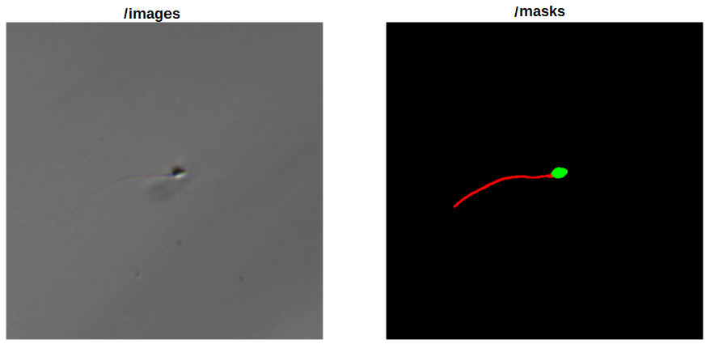
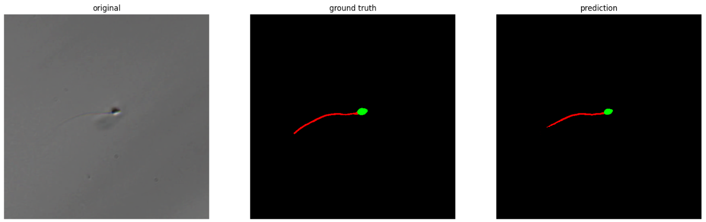

# Project: Multiclass Sperm Segmentation with U-Net in PyTorch

This project is focused on the segmentation of sperm into two classes: flagella and head, using PyTorch and U-Net architecture. The provided code structure is designed to facilitate your experimentation with various methods, such as optical flow and SlowFast[1], to tackle the challenges posed by a limited dataset with poor-quality microscopic images containing blurs and noise. This project builds upon the foundation of the [France1 multiclass project][2]. If you wish to utilize any of their notebooks or data, you can easily copy the required files from [https://github.com/France1/unet-multiclass-pytorch](https://github.com/France1/unet-multiclass-pytorch) to your local copy of this repository.


## Project Structure

Here is an overview of the project's directory structure:

```
unet-multiclass-optical_flow/
    - checkpoints/          # Contains PyTorch U-Net model parameters
    - configs/              # Contains examples of different parameters based on chosen optical flow method
    - dataloader/           # Contains functions for loading raw data
    - .gitignore
    - lib/                  # Contains functions for generating and processing training data, and for model visualization
    - model/                # Contains model components and related functions
    - notebooks/            # Contains Jupyter notebooks for preparing training data and model inference/evaluation
    - pytorchvideo/         # Contains code necessary to run the SlowFast model
    - config.json           # Defines all the parameters for the analysis
    - runs/                 # Contains Tensorboard summary files
    - README.md             # This file
    - requirements.txt      # Lists the required Python packages
    - train.py              # Main script for model training
    - data/                 # Directory for storing your dataset
        - images_train/     # Training images
            - images/
            - masks/
        - images_test/      # Test images
            - images/
            - masks/
```
## Data Organization

To structure your data for training and testing, it is recommended to organize your dataset as follows:

```
data/
    - images_train/   # Training images
		- images/
            - 0.png
            - ...
            - N.png
		- masks/
		    - 0.png
            - ...
            - N.png

    - images_test/    # Test images
		- images/
            - 0.png
            - ...
            - N.png
		- masks/
		    - 0.png
            - ...
            - N.png

```

Here's how the data is organized:

- `data/images_train/` contains training images and their corresponding masks.
  - `images/` stores the training images, named from `0.png` to `N.png`.
  - `masks/` stores the masks corresponding to the training images, also named from `0.png` to `N.png`.


All images, whether for training or testing, are placed in a single folder with names ranging from `0.png` to `N.png`. This structure accommodates sequences of frames from microscopic videos and simplifies the organization of the data.

When loading the data using `SPDataset()`, the images are automatically divided into sequences of a specified length (default is 10). This ensures that the data loader handles sequences of frames correctly during training.

Feel free to customize the sequence length by modifying the `sequence_length` parameter in `config.json` to suit your specific dataset's requirements.

You should place your training images in the `images_train` directory and your test images in the `images_test` directory. The code in this project assumes this data organization, so it's essential to follow this structure to ensure that the data loading functions work correctly.

Example of how images and masks looked like in my dataset:
<div align="center">
    
</div>

# Getting Started

Follow these steps to set up and start working with the project:

1. **Environment Setup**: Create a virtual environment and install the required dependencies.

    First, create a virtual environment (replace 'myenv' with your preferred environment name):

    ```shell
    python3 -m venv myenv
    ```

    Activate the virtual environment:

    ```shell
    source myenv/bin/activate
    ```

    Once the virtual environment is active, install the necessary dependencies by running:

    ```shell
    pip install --upgrade pip
    pip install -r requirements.txt
    ```

    This ensures that your project uses the correct Python packages and versions.

2. **Configuration**: Modify all training parameters in the `config.json` file to match your specific dataset and requirements.

3. **Training**: Start the training process by running the following command:

    ```shell
    python3 train.py
    ```

    Your model training will begin using the configurations specified in `config.json`.

4. **Monitor Progress**: You can monitor your training progress using Tensorboard. Use the following command, replacing `.runs/name_of_the_run_folder` with the actual path:

    ```shell
    tensorboard --logdir .runs/name_of_the_run_folder
    ```

    This allows you to visualize and track your training performance in real-time.

Now you're ready to get started with the project. Feel free to adapt and customize it to your specific dataset and segmentation requirements.

## Project Details

This project was initiated to address the challenging task of sperm segmentation, particularly in scenarios with small, poor-quality datasets consisting of microscopic images with blurs and noise. The primary objectives of this project are:

- Explore different segmentation methods, including optical flow, semantic segmentation (U-Net), and segment moving objects techniques.
- Provide the option to augment the dataset by converting original images into patches, enabling initial training on a larger dataset.

### Segmentation Methods

The project incorporates several segmentation methods to address the unique challenges of the dataset:

#### SlowFast

- `slowfast_images` method calculates optical flow using a SlowFast model and appends it to image frames. This integration allows for the extraction of temporal information to improve segmentation.

- `slowfast_images_iterative` method performs an iterative process to calculate optical flow and append it to image frames using a SlowFast model.

Depending on the length of your video and your specific requirements, you may need to adjust the parameters in the `config.json` file under the `slowfast` section. These parameters include `sequence_length` and the slow-to-fast ratio.

For a more in-depth understanding of these parameters and their impact, you can refer to the original paper on SlowFast networks [2].


#### TV-L1 Optical Flow

- `TVL1_iterative` method performs an iterative process to calculate optical flow using the TV-L1 algorithm and appends it to image frames. This approach provides temporal information for neural network training.

#### Object Detection

- `stack_and_get_middle_masks` method stacks consecutive image frames and extracts middle masks for object detection. This is useful for training convolutional neural networks (CNNs) to predict object positions in the middle frame of a sequence.

It's important to note that the effectiveness of these methods may vary based on the characteristics of your dataset. Depending on your particular dataset, these methods might improve or decrease the quality of the model compared to training a simple U-Net model.

## Model Inference

To perform model inference on your test images, you can use the notebook located at `notebooks/Image_predict.py`. This notebook loads the trained model from the provided path and its corresponding `config.json`, which was saved during the training process.

Before using the notebook, make sure to update the `data_folder` parameter in the `config.json` file to point to the folder where your test images are located.

Here's an example of a predicted segmentation mask generated by the model for a full image:

<div align="center">
    
</div>

## References

- [SlowFast Repository](https://github.com/facebookresearch/SlowFast) [1]
- [U-Net Multiclass Repository](https://github.com/France1/unet-multiclass-pytorch) [2]
- Ronneberger O., et al. U-Net: Convolutional Networks for Biomedical Image Segmentation, (2015) [3]